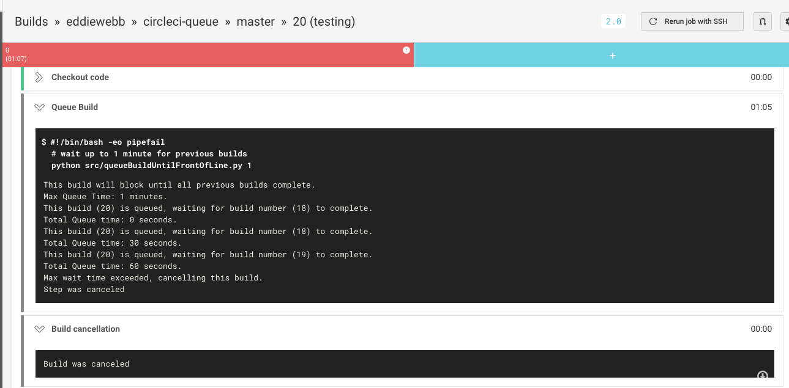

# CircleCI Concurrency Control Orb
CircleCI Orb to limit workflow concurrency.

WHy?  Some jobs (typically deployments) need to run sequentially and not parrellel, but also run to completion. So CircleCI's native `auto-cancel` is not quite the right fit.
See https://github.com/eddiewebb/circleci-challenge as an example using blue/green cloud foundry deployments.

[](https://circleci.com/gh/eddiewebb/circleci-queue/tree/master)

## Basic Usage
This adds concurreny limits by ensuring any jobs with this step will only continue once no previous builds are running.  It supports a single argument of how many minutes to wait before aborting itself and it requires a single Environment Variable `CIRCLECI_API_KEY` - which can be created in [account settings](https://circleci.com/account/api).


## Screenshots / Examples
Suppose we have a workflow take takes a little while to run.  Normally the build (#18) will run immediately, with no queuing.


Someone else on the team makes another commit, since the first build (#18) is still running, it will queue build #19.


It's late afternoon, everyone is pushing their commits in to ensure they are good before they leave for the day. Build #20 also queues.


Meanwhile, build #19 is now allowed to move forward since build #18 finished.


Oh No!  Since `1 minute` is abnormally long for things to be queued, build #20 aborts itself, letting build #19 finish uninterupted.



# Setup

```
version: 2.1
  orbs:
    queue: eddiewebb/queue@volatile

jobs:
  some-job:
    docker:
      - image: eddiewebb/circleci-queue:latest  
    steps:
      - queue/until_front_of_line:
          time: 10 # max wait, in minutes (defautl 10)
          consider-job: true #only block for this job or anyrunning builds in this project?
          consider-branch: true #only block of running job is on same branch (drefaut true)
          dont-quit: If max-time is exceeded, this option will allow the build to proceed.

      - checkout
      - ...   #your commands
 

```
